# VSCode 扩展使用指南

## 已安装的扩展列表

### 🔧 C/C++ 开发
1. **C/C++ Extension Pack** (ms-vscode.cpptools-extension-pack)
   - 功能: IntelliSense, 调试, 代码浏览
   - 用途: C/C++ 开发基础套件

2. **clangd** ⭐ (llvm-vs-code-extensions.vscode-clangd)
   - 功能: 基于 LLVM 的语言服务器
   - 优势: 比 cpptools 更快的代码补全和更准确的错误检测
   - 使用: 安装后自动工作,支持 C++20/23 新特性
   - ⚠️ 注意: 可能与 cpptools 冲突,建议在设置中禁用 cpptools 的 IntelliSense

3. **Better C++ Syntax** ⭐ (jeff-hykin.better-cpp-syntax)
   - 功能: 增强的 C++ 语法高亮
   - 优势: 更精确的语法着色,支持现代 C++ 特性
   - 用途: 提升代码可读性

4. **CMake Tools** (ms-vscode.cmake-tools)
   - 功能: CMake 项目支持
   - 用途: 如果项目使用 CMake 构建

### ☕ Java 开发
1. **Extension Pack for Java** (vscjava.vscode-java-pack)
   - 包含: Language Support, Debugger, Maven, Test Runner
   - 功能: Java 开发全家桶

2. **Spring Boot Tools** ⭐ (vmware.vscode-spring-boot)
   - 功能: Spring Boot 项目智能提示
   - 支持: application.properties, application.yml
   - 用途: Spring/Spring Boot 开发必备

### 🐍 Python 开发
1. **Python** (ms-python.python)
   - 功能: Python 语言支持、调试、测试
   - 版本: Python 3.14.0

2. **Pylance** (ms-python.vscode-pylance)
   - 功能: 高性能 Python 语言服务器
   - 优势: 类型检查、智能补全、快速导航

### 🎨 主题和图标
1. **Material Icon Theme** ⭐ NEW (pkief.material-icon-theme)
   - 功能: 文件和文件夹图标美化
   - 特点: 支持 500+ 文件类型,自定义颜色
   - 安装量: 3100万+

2. **Dracula Theme** ⭐ NEW (dracula-theme.theme-dracula)
   - 功能: 护眼深色主题
   - 特点: 高对比度,支持所有编程语言
   - 安装量: 950万+

### 📝 Markdown 增强
1. **Markdown Preview Enhanced** ⭐ NEW (shd101wyy.markdown-preview-enhanced)
   - 功能: 超强 Markdown 预览
   - 特性: 数学公式、Mermaid 流程图、导出 PDF/HTML
   - 安装量: 784万+

### ✅ 生产力工具
1. **Todo Tree** ⭐ NEW (gruntfuggly.todo-tree)
   - 功能: 树状视图显示所有 TODO/FIXME
   - 特点: 自动扫描工作区,支持自定义标签
   - 安装量: 654万+

2. **Bookmarks** ⭐ NEW (alefragnani.bookmarks)
   - 功能: 代码行书签和快速跳转
   - 快捷键: Cmd+Opt+K 添加, Cmd+Opt+J/L 跳转
   - 安装量: 460万+

3. **Prettier** ⭐ NEW (esbenp.prettier-vscode)
   - 功能: 代码自动格式化
   - 支持: JS/TS/CSS/HTML/JSON/Markdown 等
   - 安装量: 6189万+ (最流行的格式化工具)

### 🚀 通用工具
1. **Code Runner** ⭐ (formulahendry.code-runner)
   - 功能: 一键运行代码片段
   - 支持: C, C++, Java, Python, JavaScript 等 40+ 语言
   - 快捷键: `Ctrl+Alt+N` (macOS: `⌃⌥N`)
   - 用途: 快速测试代码片段,无需配置

2. **GitHub Copilot** (github.copilot)
   - 功能: AI 代码助手
   - 用途: 代码补全、生成、重构

3. **GitHub Copilot Chat** (github.copilot-chat)
   - 功能: AI 对话式编程助手
   - 用途: 代码解释、问题解答、代码审查

4. **GitLens** (eamodio.gitlens)
   - 功能: Git 历史可视化
   - 用途: 代码作者追踪、分支对比

5. **IntelliCode** (visualstudioexptteam.vscodeintellicode)
   - 功能: AI 辅助的代码补全
   - 用途: 基于最佳实践的智能建议

6. **EditorConfig** (editorconfig.editorconfig)
   - 功能: 统一代码风格
   - 用途: 团队协作时保持一致的格式化规则

7. **Docker** (ms-azuretools.vscode-docker)
   - 功能: Docker 容器管理
   - 用途: 容器化应用开发

## 🎯 快速使用指南

### Code Runner 使用
```bash
# 运行当前文件
快捷键: Ctrl+Alt+N (macOS: ⌃⌥N)

# 运行选中代码
选中代码后按快捷键

# 停止运行
快捷键: Ctrl+Alt+M (macOS: ⌃⌥M)
```

### clangd vs cpptools
如果要使用 clangd (推荐),需要在 `.vscode/settings.json` 添加:
```json
{
  "C_Cpp.intelliSenseEngine": "disabled",
  "clangd.path": "clangd"
}
```

### Spring Boot 智能提示
在 `application.properties` 或 `application.yml` 中输入 `spring.` 即可看到所有配置项提示。

## 📝 可选扩展推荐

### C/C++ 进阶
- **Makefile Tools** (ms-vscode.makefile-tools): Makefile 项目支持
- **C/C++ Runner** (franneck94.c-cpp-runner): 快速编译运行单文件

### Java 进阶
- **Spring Boot Extension Pack** (vmware.vscode-boot-dev-pack): Spring 全家桶
- **Oracle Java** (oracle.oracle-java): Oracle 官方 Java 扩展

### 代码质量
- **Trunk Code Quality** (trunk.io): 统一的代码格式化和静态分析
- **Tabnine** (tabnine.tabnine-vscode): 另一款 AI 代码助手(Copilot 替代品)

## 🔥 性能优化提示

1. **禁用不需要的扩展**: 在特定语言项目中禁用其他语言扩展
2. **使用 clangd 代替 cpptools IntelliSense**: 更快更准确
3. **配置 Code Runner 输出**: 可以在设置中自定义运行命令
4. **定期更新扩展**: 获取最新功能和性能改进

## � 主题和外观

### Material Icon Theme ⭐ NEW
1. **启用图标主题**: `Cmd+Shift+P` → "File Icon Theme" → 选择 "Material Icon Theme"
2. **自定义配置**: 支持多种图标风格和颜色
3. **文件夹图标**: 特定文件夹(如 src, test, docs)有独特图标

### Dracula Theme ⭐ NEW
1. **切换主题**: `Cmd+K Cmd+T` 或 `Cmd+Shift+P` → "Color Theme" → "Dracula"
2. **特点**: 护眼深色,高对比度,支持多种语言语法高亮
3. **官方主题**: 全球 1000+ 编辑器和工具统一主题

## 📝 Markdown 增强

### Markdown Preview Enhanced ⭐ NEW
1. **预览**: 右键 Markdown 文件 → "Markdown Preview Enhanced: Open Preview"
2. **快捷键**: `Cmd+K V` (侧边预览) 或 `Cmd+Shift+V` (标签预览)
3. **导出 PDF**: 预览窗口右键 → "Chrome (Puppeteer) → PDF"
4. **特性**: 支持数学公式 (KaTeX)、Mermaid 流程图、PlantUML、代码块运行

**示例 - 在 Markdown 中添加流程图:**
````markdown

```mermaid
graph TD
    A[开始] --> B{条件判断}
    B -->|是| C[执行操作]
    B -->|否| D[结束]
    C --> D
```

````

## ✅ TODO 管理

### Todo Tree ⭐ NEW
1. **查看 TODO**: 侧边栏自动显示 "Todo Tree" 面板
2. **支持标签**: TODO, FIXME, HACK, XXX, BUG, NOTE 等
3. **自定义高亮**: 在设置中配置不同标签的颜色和图标
4. **快速跳转**: 点击 TODO 项直接跳转到代码位置

**在代码中使用:**
```java
// TODO: 实现用户登录功能
// FIXME: 修复空指针异常
// HACK: 临时解决方案,需要重构
```

## 🔖 书签管理

### Bookmarks ⭐ NEW
1. **添加书签**: `Cmd+Opt+K` (Toggle Bookmark)
2. **跳转书签**: 
   - `Cmd+Opt+J` (跳转到下一个书签)
   - `Cmd+Opt+L` (跳转到上一个书签)
3. **查看所有书签**: 侧边栏 "Bookmarks" 面板
4. **带标签书签**: `Cmd+Shift+P` → "Bookmarks: Toggle Labeled"

## 💅 代码格式化

### Prettier ⭐ NEW
1. **格式化快捷键**: `Shift+Opt+F` 或右键 → "Format Document"
2. **保存时自动格式化**: 
   ```json
   {
     "editor.formatOnSave": true,
     "editor.defaultFormatter": "esbenp.prettier-vscode"
   }
   ```
3. **支持语言**: JavaScript, TypeScript, CSS, HTML, JSON, Markdown, YAML
4. **配置文件**: 创建 `.prettierrc` 自定义规则
   ```json
   {
     "semi": true,
     "singleQuote": true,
     "tabWidth": 2,
     "printWidth": 100
   }
   ```

## �🆘 故障排除

### clangd 无法工作
1. 确保已安装 Clang: `clang --version`
2. 检查 clangd 路径: `which clangd`
3. 重启 VSCode

### Code Runner 输出乱码
在设置中搜索 "code-runner.executorMap",修改编译参数添加 `-fexec-charset=UTF-8`

### Spring Boot 提示不工作
1. 确保项目有 `pom.xml` 或 `build.gradle`
2. 重新加载 Java 项目: `Cmd+Shift+P` → "Java: Clean Java Language Server Workspace"

### Prettier 不格式化
1. 检查是否设置了默认格式化器
2. 确保文件类型在 Prettier 支持列表中
3. 查看输出面板 "Prettier" 频道的错误信息
